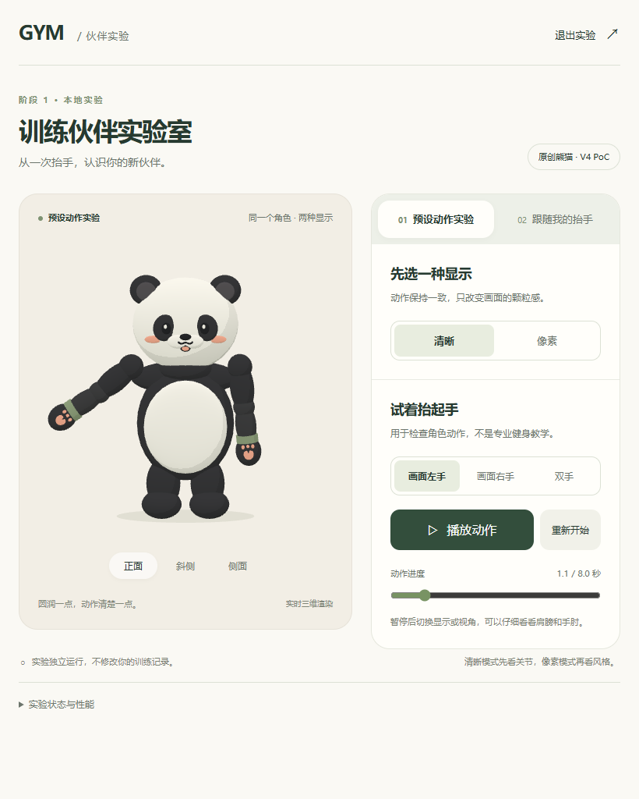
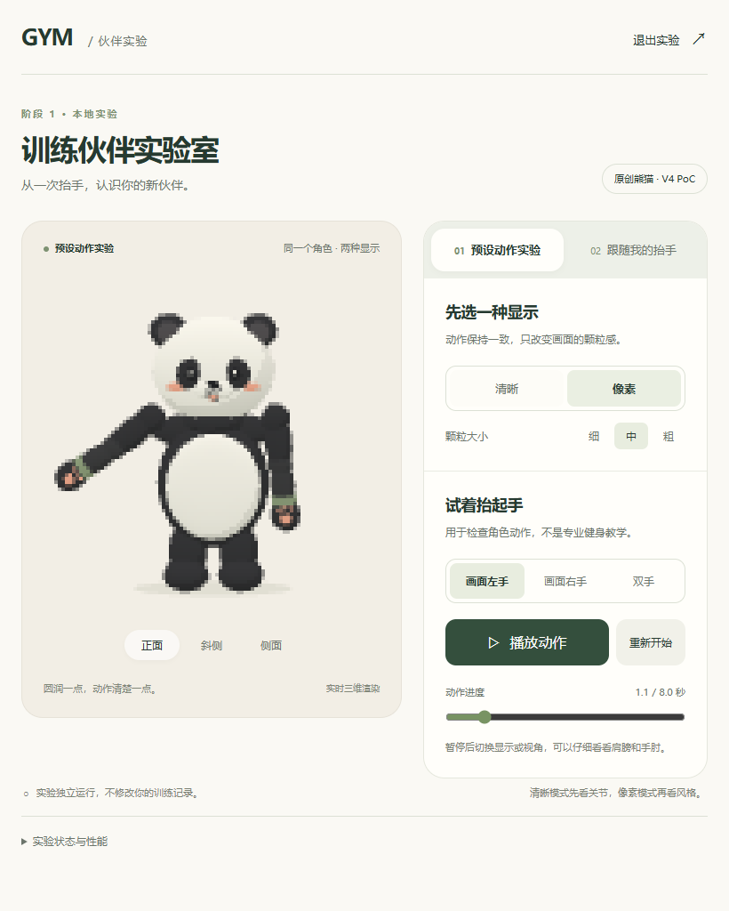

# V4 阶段 1：原创熊猫本地实验交付

日期：2026-10-07。版本标签：**原创熊猫 · V4 PoC**。已完成可体验的软件实验；真实人体跟随、真实手机及教学审校分别保持未测，不能概括为全部验收通过。

## 打开与操作

入口：[本地训练伙伴实验室](http://127.0.0.1:4175/?companion-lab=1)。本轮交付时服务保留运行，仅监听本机回环地址。

重新启动：在 `E:\gym` 运行 `npm run dev:companion`。停止前端服务按 Ctrl+C；停止相机可用「停止摄像头」、切换回预设、退出实验或隐藏页面。重新显示页面不会自动打开相机。端口占用时脚本报错，不结束其他服务。

先选「画面左手 / 画面右手 / 双手」播放预设；暂停后可拖动进度、比较清晰与像素显示，再用正面、斜侧和侧面看肩肘。预设是一段 8 秒抬起、短停、放下曲线。镜像需你进入「跟随我的抬手」，阅读说明后亲自点击开启摄像头。保持单人正对镜头、上半身可见，向身体两侧抬手；前伸、交叉和任意三维动作不在本轮表达范围。

`npm run build:companion` 构建到 `evals/virtual-companion/v4-poc/build`，不覆盖原 `dist`，不加载 env 文件。没有部署或自动进入下一阶段。

## 实际效果与完成状态

以下为最终程序真实 WebGL 画面，同一角色、同一暂停姿势、正面镜头、同样光照与 426×420 CSS 画布，DPR=1。像素中档实际缓冲为 106×105。没有使用设计图替代运行结果。

| 清晰模式 | 像素模式（中档） |
| --- | --- |
|  |  |

[实际预设动作录像](actual-render/preset-clear-actual.webm)约 16 秒，画面明确标为预设与真实渲染，没有人体、相机画面或真实镜像内容。原始截图、录像和测试时源码哈希保留在评测目录；[概念图](character-direction/construction-guide.png)仍只代表设计意向。

| 交付对象 | 状态与范围 |
| --- | --- |
| 三维资产 | 已完成原创程序化分段网格，肩→肘→手父子关节；约 2.7 头身，哑光黑白色块与浅绿腕带。不是完整蒙皮模型，不输出未验证的 GLB |
| 渲染 | 已完成清晰、像素 2/4/6 三档及三个检查视角；共用同一三维场景和姿势；有像素回退与 WebGL 失败出口 |
| 预设 | 已完成左右/双臂抬手、暂停、重启、进度检查；根节点稳定，不写训练记录 |
| 真实姿态链路 | 已实现真实相机→本机官方模型→可信度/时效检查→有限关节映射；模型真实执行已用空白输入验证。没有用真人验证实际跟随准确性 |
| 权限与生命周期 | 固定输入与故障注入检查通过：拒绝、无设备、超时、加载中退出、晚到权限/结果、隐藏、反复进入、WebGL 丢失及资源释放 |
| 手机与真人 | 390px 是桌面尺寸模拟。真实手机、真实相机、作者自测、独立真人任务均未测 |
| 教学 | 未审校，不是动作纠错、计次、评分或专业教学 |

生成器、关节命名、坐标轴、静止姿势、渲染方式、模型配置、来源与许可见 [实现说明](IMPLEMENTATION-NOTES.md)。关键代码为 `src/companion/pandaRig.ts`、`PandaStage.tsx`、`preset.ts`、`mirror/MirrorSession.ts` 与 `mirror/mapping.ts`。

视觉核对：正面垂手、中段、顶点和侧面可辨认分段手臂；支持范围内逐网格顶点检查未发现手臂进入头部椭球。中档像素仍可分辨两臂和脸部主要色块，细节较清晰模式减少，粗档不适合检查细小关节。未据静态截图宣称所有真实设备都没有边缘闪烁或关节遮挡。

## 验证与首次失败

所有自动化浏览器采用隔离资料目录。`getUserMedia` 在页面代码前被替换为拒绝或合成灰画面流，未调用真实相机。固定关键点检查是软件回放；真实模型仅接受无人空白图像。旧测试脚本本身没有修改，旧输出目录没有覆盖。

| 检查 | 结果与证据 |
| --- | --- |
| 关节层级、对称、限角、头部交叉及资源清理 | 7/7；[最终命令记录](../../evals/virtual-companion/v4-poc/final-checks-20261007.json) |
| 映射、平滑、可信丢失/恢复、权限竞态、时间上限、网络边界 | 43/43；[软件结果](../../evals/virtual-companion/v4-poc/mirror-software-1791375636440/results.json) |
| 桌面交互及隔离 I01–I12 | 12/12；[首次完整浏览器检查](../../evals/virtual-companion/v4-poc/integration-820-1791374586818/results.json)。其中 W01 与 P01 的初始测量边界见下文，后续专项记录取代其性能/网络结论 |
| 最终比例和样式 | [桌面同姿势与三个视角](../../evals/virtual-companion/v4-poc/integration-820-1791374891983/results.json)通过；[390px 模拟 I02/I03/I04](../../evals/virtual-companion/v4-poc/integration-390-1791375084259/results.json)3/3，另保留[错误提示截图检查](../../evals/virtual-companion/v4-poc/integration-390-1791375230020/results.json) |
| 真实官方 worker | [修复后的 W01/W02](../../evals/virtual-companion/v4-poc/integration-820-1791375749983/results.json)2/2；灰画面没有检出人。W02 没有 Playwright 网络路由或 Service Worker，首次和重复初始化未观察到外域/API请求 |
| 最终构建本地检查 | [生产构建 I02/W02](../../evals/virtual-companion/v4-poc/integration-820-1791376011888/results.json)2/2：实际角色渲染可用、未读写档案；worker 响应 CSP 生效，无路由拦截，两个 worker 各额外保留 12 秒，只观察到同源静态 GET。运行期间阻断计数为 0，不能声称该次主动触发了遥测；主动禁止非法请求另由网络边界软件检查验证。临时 4176 preview 已关闭，4175 保留 |
| 最终构建本地检查 | [生产构建 I02/W02](../../evals/virtual-companion/v4-poc/integration-820-1791376011888/results.json)2/2：实际角色渲染可用、未读写档案；worker 响应 CSP 生效，无路由拦截，两个 worker 各额外保留 12 秒，只观察到同源静态 GET。运行期间阻断计数为 0，不能声称该次主动触发了遥测；主动禁止非法请求另由网络边界软件检查验证。临时 4176 preview 已关闭，4175 保留 |
| 既有 Gym 回归 | [八组命令](../../evals/virtual-companion/v4-poc/regression-1791374903584/results.json)全部通过：契约 18/18、内存存储 18/18；390px 与 820px 各训练浏览器 9/9、教学播放器 14/14、教学流程 6/6（每组含 3 项资料检查和 3 个浏览器场景） |
| TypeScript / 构建 / 源码 lint | `tsc -b` 和独立构建通过，限定源码及新增脚本的 lint 退出码 0。保留 Three.js 实验块约 565KB 的构建警告；它按需加载并排除 PWA 预缓存 |

首次失败没有改写成通过：

- 初期软件脚本的语法与 loader 顺序问题保留于 `mirror-software-first-run-syntax`、`mirror-software-loader-retry`；修复的是测试入口。
- 缓存测试第一次遇到开发服务器重载，页面执行上下文消失：[原始 W02 失败](../../evals/virtual-companion/v4-poc/integration-820-1791375113797/results.json)。同文件 V01 录像和 P01 运动性能仍分别通过，不能把整个文件标为全通过。
- 随后的无拦截检查发现 MediaPipe 1.1.0 尝试向 Google 日志端点发起 POST：[真实发现记录](../../evals/virtual-companion/v4-poc/integration-820-1791375224652/results.json)。输入仅合成灰画面，没有人体数据。修复后 worker 在 SDK 前锁定静态资源白名单，仅允许同源 GET/HEAD、拒绝重定向/上传及未需网络通道，并加 worker 响应 CSP。未更改 vendor。原先网络被测试路由拦截的 W01 不能证明 SDK 本身没有外联。
- 新边界拒绝旧 Blob 包装 worker 的测试方式：[保留的尝试](../../evals/virtual-companion/v4-poc/integration-820-1791375591914/results.json)。改为直接运行正式 worker URL、只读获取资源计时，没有放宽产品限制。
- 全仓 `npm run lint` 会遍历保留的历史构建和第三方压缩文件，退出码 1，输出过大被工具截断；本轮没有修改历史资料或 vendor 来消除此项。源码范围检查另列通过，不能宣称全仓 lint 通过。

## 性能口径

测试设备报告 AMD Radeon 610M，Windows 桌面 Edge 154.0.4258.62 headless，820×1024，DPR=1。自动化启动包含 `--enable-unsafe-swiftshader`；实际 WebGL renderer 报告 AMD / Direct3D11。下列是该隔离桌面环境的数据，不能外推到前台浏览器、刷新率、手机、温度或电耗。

| 测量 | 结果 | 可支持的结论 |
| --- | --- | --- |
| 清晰预设连续 60 秒 | 60,001.9ms、14,374 次实际 render，7 次重播；中位 238 FPS；帧间隔 p50=4.2ms / p95=4.4ms | [该环境满足原 30 FPS 目标](../../evals/virtual-companion/v4-poc/integration-820-1791375113797/results.json)，是调度间隔，不是 GPU 执行耗时 |
| 中档像素预设连续 60 秒 | 60,001.4ms、14,373 次实际 render，7 次重播；中位 238 FPS；p50=4.2ms / p95=4.4ms；缓冲 106×105 | [同环境通过](../../evals/virtual-companion/v4-poc/integration-820-1791375348786/results.json)，不据此宣称省电 |
| 首次 / 再次本地模型初始化 | 总耗时 203.9 / 189.0ms；准备资源 36.5 / 20.3ms；模型初始化 159.5 / 160.6ms | W02 本地回环结果，不是公网下载耗时。后次 bundle、模型和 JS loader 重新验证后复用缓存体；约 13MB WASM 仍完整传输，未实现完整离线验收 |
| 八帧灰画面真实推理 | p50=14.4ms / p95=117.7ms，含首帧热身；320×240 合成输入；全部 0 人 | W01 证明官方模型可执行，不测人体准确性或相机姿态更新率 |
| 隐藏或退出释放 | 软件会话与浏览器合成流检查通过，含晚到轨道在 1 秒内停止 | 真实相机设备灯和驱动释放待作者自测 |
| 真实跟随中位 ≥15Hz、身体静止抖动、人体丢失/恢复次数 | 未测 | 保留原目标，不降低阈值包装通过 |
| 关键点进入到实际显示、人体动作到屏幕的完整延迟 | 未测 | 界面单独显示映射处理统计；处理耗时不等于应用到屏幕或端到端延迟 |

最早 P01 是 60 秒静态姿势渲染，仍保留在首次完整结果中；上表运动结果单独重测，没有将静态结果冒充抬手性能。关键点软件检查覆盖左右、双手、放下、静止输入、缺失/遮挡、重入与平滑；这些不代替相同场景的真人验证。

生产构建的首次/后次初始化另测为总耗时 472.1/266.9ms，准备资源 242.2/40.2ms，模型初始化 219.4/214.9ms。它与开发服务的数据分开记录，不混用较快数字作为统一保证。

生产构建的首次/后次初始化另测为总耗时 472.1/266.9ms，准备资源 242.2/40.2ms，模型初始化 219.4/214.9ms。它与开发服务的数据分开记录，不混用较快数字作为统一保证。

## 资产、历史与执行边界

Three.js 固定 0.186.1（MIT）；类型声明 0.186.0（MIT）；MediaPipe Tasks Vision 1.1.0（Apache-2.0）；官方 Pose Landmarker Lite float16 v1（模型卡 Apache-2.0）。资源从同源站点提供，磁盘约 45MB，原始版本、许可副本、模型 URL 与 SHA256 见[实现说明](IMPLEMENTATION-NOTES.md)及[阶段 1 资产索引](ARTIFACTS-PHASE1.json)。普通首页不预加载实验/姿态资源，PWA 预缓存排除这些文件。

[阶段 1 增量基线](../../evals/virtual-companion/v4-poc/baseline.json)以已有脏工作区为起点。[完整性检查](../../evals/virtual-companion/v4-poc/integrity-final-1791375789294.json)：118 份既有源码/配置中仅 main、Vite、package 与 lock 四份计划内改变，114 份原样；1,304 份历史文件中仅四份维护文档更新，1,300 份原样；旧 dist 10/10 原样。没有意外改变或缺失。旧锁文件 873 个包的版本、来源和完整性哈希均保留，新增 9 个必要依赖条目。

本轮云模型调用数 **0**，没有调用 Gym 云端 AI、读取密钥、保存人体帧或姿态轨迹；测试使用合成流与固定输入。没有新增训练、体重、热量或完成记录。网络下载/流量及基础设施成本未核算，不能称全部成本为 0。全站已有字体等网络行为与姿态 worker 分开，不宣称全站零外联。

交付停在本轮范围：后续先由作者体验角色外观，再在自愿开启相机的情况下检验左右抬手、离开/回到画面与关闭释放；取得真实设备证据前继续标为受限实验。
