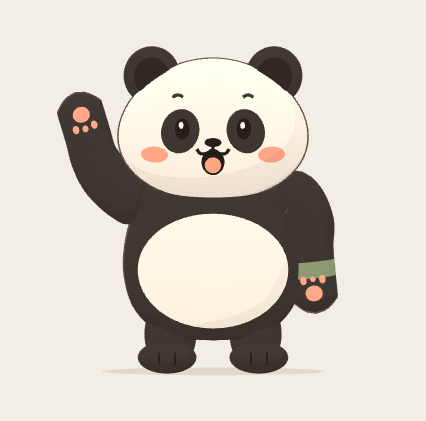
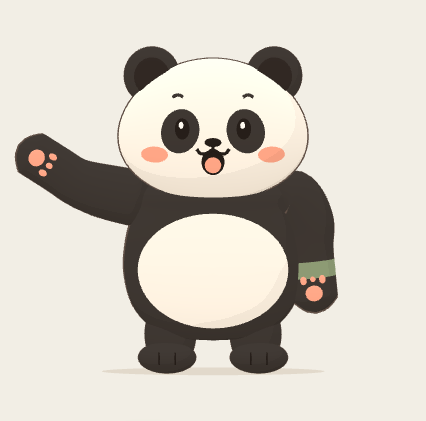
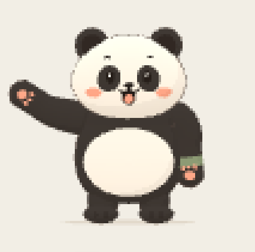

# 熊猫卡通外观重制 V4.1

2026-10-07。用户明确否定首版形象，要求按[本次参考图](user-reference.png)修改。本版已修改本地实际角色，审美结果以用户查看为准，不把软件通过等同于用户认可。

入口：[训练伙伴实验室](http://127.0.0.1:4175/?companion-lab=1)，页面标记「参考图重制 · V4.1」。刷新即可看到当前版本；服务未运行时在 `E:\gym` 执行 `npm run dev:companion`。

## 实际画面

| 同姿势清晰模式 | 同姿势像素模式（中档） |
| --- | --- |
|  |  |

以上均为实际 WebGL 画布截图，未用参考图或生成图替代角色。[实际预设动作录像](actual-preset-clear.webm)只记录软件中的熊猫动画，没有人体或摄像头画面。原始全页、390px、侧面和其他动作截图保留于评测目录。

## 外观修改

- 宽圆脸、大耳朵、短胖梨形身体和横向白肚，替换原先修长体型。脸宽约 1.72、脸高约 1.30 场景单位，总高约 3；不再机械沿用初版 2.7 头身。
- 眼斑、眉毛、腮红、张口笑容贴合头部曲面，修复眉毛被脸遮住的问题；头部前移，让圆下巴完整地盖在胸前。
- 删除可见的肩球、肘球、分色前后臂和双腕带，改连续柔软曲面及单侧绿色袖带。肩根收在躯干内，抬手时不形成外露尖角。
- 白肚是随身体弯曲的色块，增加薄轮廓线与暖白柔光，减轻护甲、塑料与灰绿色观感。

`pandaRig.ts` 仍提供真实三维网格和肩→肘→手的父子关系。手臂表面按肩肘角度连续变形，手掌细节仍随手节点运动；不是一张图片、预渲染动画或导入蒙皮模型。参数为肩 X=±0.84、Y=1.60，上臂 0.43、前臂 0.38；头中心 Y=2.25、Z=0.28，基础半径 0.86/0.65/0.47，下半脸加宽。原角度范围、左右镜像映射和预设曲线保留。

## 验证和记录

- TypeScript、限定源码 lint、[独立构建](../../../evals/virtual-companion/v4-cartoon-revision/build-1791378523158/result.json)通过。构建仍有约 567KB 三维实验块警告，按需加载；未改变阈值消除警告。
- [几何检查](../../../evals/virtual-companion/v4-cartoon-revision/rig-1791378365603/results.json)9/9：父子变换、有限位置/法线、左右对称、资源释放通过。1,378 组姿态、约 2,697 万个表面顶点样本未进入实际梨形脸部；这是离散顶点检查，不是任意连续运动的全部碰撞证明。
- [最终桌面 820/390px 检查](../../../evals/virtual-companion/v4-cartoon-revision/browser-1791378370777/results.json)每个视口 8 组通过：左右/双手、暂停/重新开始、清晰/像素同姿势、三档像素、三视角、布局和存储隔离。[当前最终模型录像检查](../../../evals/virtual-companion/v4-cartoon-revision/browser-1791378524081/results.json)通过。
- 首轮检查把既有 Google Fonts 请求尝试也要求为零，断言失败；请求已被测试拦截。[首轮结果](../../../evals/virtual-companion/v4-cartoon-revision/browser-1791377926726/results.json)保留，后续明确记录字体拦截，继续禁止模型、API、真实相机和其他外部请求。没有修改产品字体来掩盖测试问题。
- 中间两轮实际截图及几何检查也保留；最后修正了圆下巴遮挡、色彩偏黄及肩根尖角。

本次仅改变三个产品文件：`pandaRig.ts`、`PandaStage.tsx`、`CompanionLab.tsx`（版本标签）。识别与相机代码、权限释放、预设映射、package/lock、主入口和 Vite 配置均保持本轮基线哈希一致。新基线、源码与实际媒体哈希见 [ARTIFACTS.json](ARTIFACTS.json)。旧阶段 1 证据、构建和交付报告保留。

390px 是桌面尺寸模拟，未开启真实摄像头，也未重复真人/真机验收或旧版的 60 秒性能实验；不能把首版 FPS 当本版性能成绩。当前原型的真人跟随与真实手机仍待用户主动测试。本轮未部署、未调用云模型、未改训练记录。

复现本次构建可运行 `node scripts/build-companion-cartoon-v4.mjs`，它先做 `tsc -b`，再禁用 env 文件加载，输出到新的 `evals/virtual-companion/v4-cartoon-revision/build-时间戳/app`，保留此前构建。
