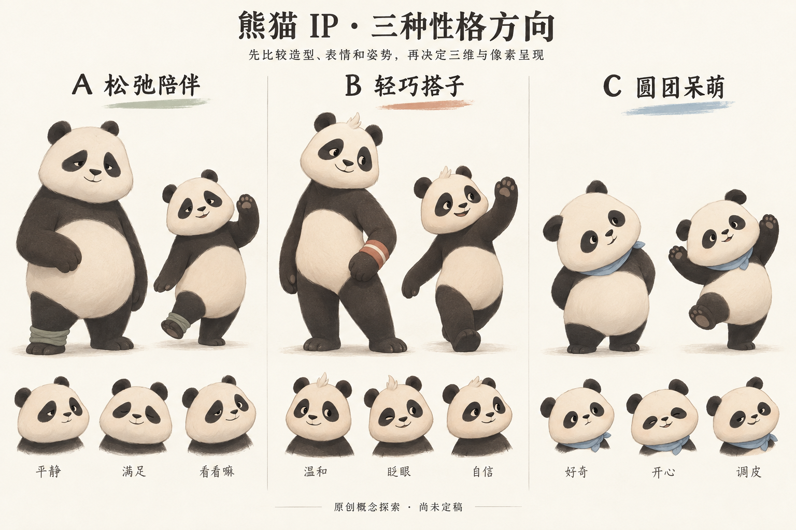

# 熊猫 IP 设计参考研究

检索日期：2026-10-07。覆盖中文、日文与英文来源中的应用角色、品牌吉祥物、潮玩和影视动画，选出 10 个有明确出处、设计取向不同的案例。这里的适配与美感评价是设计判断，不是用户测试结果。

本轮目标是为 Gym 做好原创熊猫的造型、性格和动作设计。用户已反馈当前实现缺少美感、动作僵硬，要求先研究和设计，再交给代码窗口。当前不进行产品代码修改。

## 最值得先看的四个案例

### Wise Panda 的陪伴表演

出处：[Animwood 与主创的 Wise Panda 作品集](https://www.behance.net/gallery/193406687/Wise-Panda-Brand-Mascot?locale=en_US)。

该项目为学习产品设计熊猫 Hui，风格确定后制作 12 种 Lottie 动画；项目页展示从草图到矢量图，再到动画的过程。最值得借鉴的是先明确角色如何鼓励、如何回应，再设计动作。对 Gym 而言，待机、招呼、专注和休息应该有不同的表演意图。

不直接借用其人物形象或动画资产，也不因同为 App 就默认必须改用它的技术方案。

### 乐天购物熊猫的平面与立体一致性

出处：[官方角色站](https://event.rakuten.co.jp/okaimonopanda/)、[官方动画与舞蹈页](https://content-central.rakuten.net/content/anime/Okaimonopanda/special/dance_contest/)。

它适合研究简洁的黑白造型如何在不同媒介中保持身份。乐天的[舞蹈制作说明](https://corp.rakuten.co.jp/news/update/2016/1019_01.html)列出了专门编舞和三维制作，提醒我们：角色能动与动作有吸引力，需要不同层面的工作。

可学清楚的轮廓与整体表演，不沿用其准确五官、商业标志或舞步。

### PANDA ROLL 的柔软体块与姿态

出处：[52TOYS 官方芭蕾系列](https://www.52toys.jp/view/item/000000000197)、[官方系列目录](https://www.52toys.jp/view/category/pandaroll)。

这类潮玩适合研究圆身体、短肢和倾斜姿态如何同时成立。官方芭蕾系列说明使用植绒表面，底材为 PVC/ABS；这些是实体产品信息，不等于应用应该模拟毛发。

学习定格姿势与体块衔接，不能把漂亮雕塑直接当成能连续变形的模型或已有动画。

### HungryPanda 的完整角色延展

出处：[朝鹿文化创意设计的作品集](https://www.behance.net/gallery/167663197/HUNGRY-PANDA-IP)。

作者将角色 Hapii 的策划、平面图、渲染图和动态延展放在同一项目中。可以学习同一个身份如何覆盖走路、奔跑、招呼等行为，以及如何在每个姿势中保持辨识度。

它的明亮商业气质、服装和配色未必适合 Gym 的长期陪伴，不应整套照搬。

## 其他六个对照方向

| 案例与来源 | 建议观察 | 对 Gym 的适用边界 |
| --- | --- | --- |
| [Panda / 咱们裸熊，Cartoon Network 官方片段](https://www.youtube.com/watch?v=YAZ46f-NW-k) | 简单五官怎样配合生活姿态，形成有情绪的陪伴角色 | 可学日常反应和性格；不是运动教学模板 |
| [Po / 功夫熊猫，DreamWorks 官方](https://www.dreamworks.com/movies/kung-fu-panda) | 圆胖角色的身体朝向、重心和动作态度 | 可学动作组织；电影级毛发、武术服饰和大幅夸张不是本项目必需 |
| [たれぱんだ / 趴趴熊，San-X 官方](https://www.san-x.co.jp/ja/characters/tarepanda/) | 身体姿态本身如何体现松弛与柔软 | 适合休息状态；极短肢与低扁身体未必适合清楚表达训练动作 |
| [PANGYO，LINE FRIENDS 官方](https://linefriends.com/en/characters-list/ip-linefriends) | 克制的装饰、稳定的笑容和低刺激陪伴气质 | 温和不应等于僵直呆站，运动语言仍需独立设计 |
| [冰墩墩，北京官方资料](https://english.beijing.gov.cn/beijing2022/mascotsandtorches/202103/t20210316_2308713.html) | 简单主体与一个强烈识别特征怎样建立角色身份 | 可学“记忆点集中”；透明壳和短肢不适合作为本次肩肘活动方案的直接模板 |
| [Nicopanda，设计方 DE-YAN](https://www.de-yan.com/work/nicopanda) | 更图形化、偏潮流的熊猫识别系统 | 可学减少幼儿感；标志系统不能替代完整身体与动态设计 |

额外的短爪卡通参考：[Sanrio PANKUNCHI](https://www.sanrio.co.jp/characters/pankunchi/)。其童趣和故事感可供比较，但不默认采用幼童定位。

## 动作资料应该怎么看

先观察一个角色如何站立、转头、停下和恢复平静，再看跳跃等大动作。不要只收藏最夸张的一帧。

- [Shine 的功夫熊猫片尾设计过程](https://www.shinestudio.com/project-pages/film/kung-fu-panda)：用同一情境中的不同表演理解角色性格，也可研究图形化表现。
- [Cartoon Network 官方熊熊舞蹈合集](https://www.youtube.com/watch?v=WqkV71QgO7A)：作为整段表演的观看入口。
- [Disney 动画制作流程](https://www.disneyanimation.com/process/animation/)：清楚的表演、时间控制、重量感与身体跟随需要共同设计。
- [Animation Mentor 身体跟随教程](https://www.animationmentor.com/blog/follow-through-and-overlapping-action-the-12-basic-principles-of-animation/)：帮助理解不同部位同一时刻启动、停止造成的僵硬。
- [Animation Mentor 姿势与剪影教材](https://content.animationmentor.com/pdfs/TipsAndTricks_Volume1.pdf)：帮助检查手臂和胸部之间的留白。
- [Pixar 青春变形记设计介绍](https://www.pixar.com/turning-red/)：仅作为圆润动物的表达补充；片中是小熊猫，不能混称大熊猫。
- [Disney 大白动画幕后](https://video.disney.com/watch/animating-baymax-big-hero-6-behind-the-scenes-50d5cfb8f79b926f650108c3)：用来校准“更多晃动不必然更有生命”的判断。

视频入口已核验发布来源；本轮没有逐帧分析其节拍，不提供虚构的时间码或节奏测量。

## 结合项目现状的观察

项目记录已出现 V4.1、V4.2 和 V4.3。V4.3 的[交付说明](../illustrated-revision/DELIVERY.md)记录当前路线为 Canvas 2D，而非旧 Three.js 方案。本轮没有回滚、重建或修改这套实现。

本轮查看了[项目保存的用户参考图](../illustrated-revision/user-reference.png)与[V4.3 实际姿势图](../illustrated-revision/actual-poses.png)。静态层面可以看到：

- 参考中躯干会随动作压低、扭转和倾斜，脚掌的透视和面积也会改变。
- 实际姿势图中，多数躯干仍保持较接近的竖向轮廓，主要差别集中在手脚位置。
- 因此，下一轮美术设计应该画清楚完整身体在动作中的形状变化，不能只提供中性站姿和关节名称。

这不是完整动画诊断：未在本轮逐帧观看项目动画，无法仅凭静态图确定速度曲线、延迟或衔接问题。

## 原创探索与当前判断

A 松弛陪伴偏温和，B 轻巧搭子偏活动能力，C 圆团呆萌偏宠物感。该图先于本轮补读 V4.2/V4.3 记录生成；其中 B 的较长四肢不应自动覆盖项目后来记录的短爪偏好。

结合项目保存的短爪参考，新增 D 短爪灵动：短爪、圆身，表情有一点机灵；动作依靠全身的方向与形变表达。用户随后已选择 D，认可整体形象，并要求增加少量草帽和竹子；最新成果见[D2 深化稿](d-refinement/REFINEMENT.md)。方向选择不等于工程蓝图完成，正面与斜侧的区分、统一比例、腕带位置和转面一致性仍需精修。

像素偏好保留。先把清晰的角色和姿势设计好，再验证像素版的眼神、手爪与身体留白；像素颗粒不能用于掩盖造型问题。二维、三维或混合实现应服务于确认后的美术目标，不在本轮强行锁定。

下一步的完整设计内容见[角色与动作设计草案](IP-DESIGN-DRAFT.md)。本研究、生成图和原站图片都不是可直接复用的三维模型或动画资产。外部图片由原站托管，并附来源；原创草案的生成提示词保存于[图像生成记录](image-prompts.json)。

