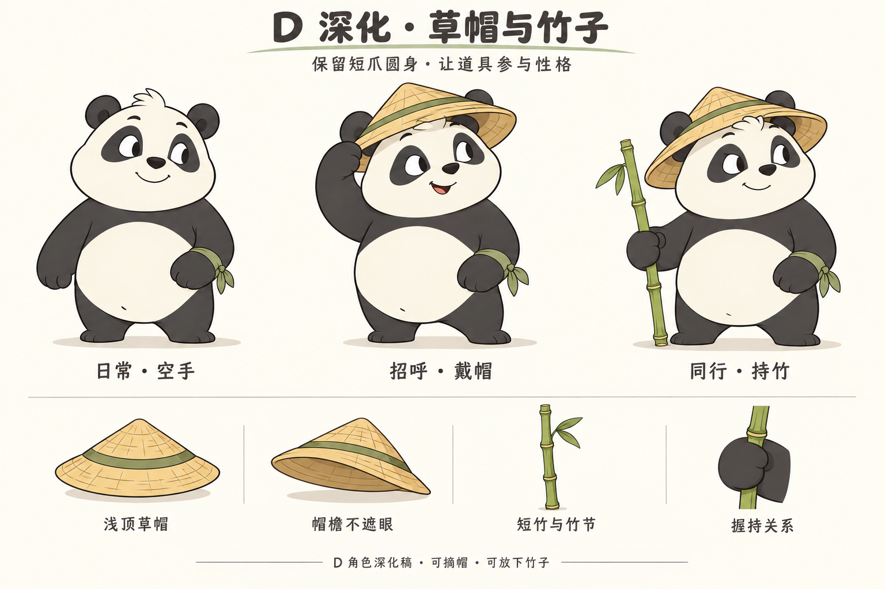
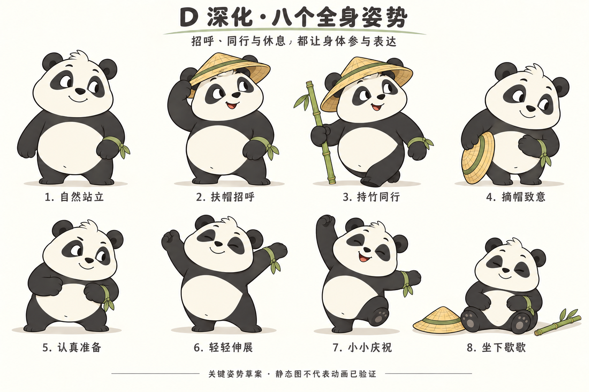

# D 熊猫草帽与竹子深化稿

> 后续更新：用户认可整体形象，并要求动作更大、更活泼，表情更夸张。D2 保留为本体、配件与常态参考；最新动作峰值和表情扩展见[D3 活力版](../d3-expression-motion/D3-REVIEW.md)。

2026-10-07。用户已选定 D 短爪灵动，认可整体形象，并提供参考图，要求增加少量草帽、竹子等道具后继续深化。D 为已选主方向；本页三张新图属于 D2 深化提案，具体配件与细节尚未逐项定稿。

## 主形象与道具

保留 D 的略方奶白面颊、小黑鼻、短口鼻、圆耳、额前毛簇、梨形腹部与短厚熊掌。没有把用户的新参考作为替换角色的目标：参考仅用于草帽、竹子和道具参与姿势的思路。

三种状态共用同一个本体：
- 日常空手：完整露出脸型和毛簇，作为身份与比例的基准。
- 戴帽招呼：帽檐略后倾，一只爪轻扶帽檐，身体小幅倾向来者。
- 持竹同行：戴同一顶帽，竹子由角色自身右爪握持，位于身体外侧，左腕保留原绿色腕结。

当前建议保留两件主要道具，不再叠加披风、背包、腰带等装饰。腕结是原 D 的小识别点；像素版可以简化结头与飘带，不把细小纹样作为身份的必要条件。

### 草帽

采用低帽冠、麦秆色与少量绿色帽带。帽檐稍宽于头部，前檐抬起，保持眉、眼和面颊清楚。材质通过轮廓、两档明暗和少量编织线表达，不追求密集写实纹理。

佩戴、扶帽、摘帽、放下四个状态必须属于同一顶帽。后续精修应统一帽冠高度、帽檐厚度及耳朵前后遮挡，避免帽子随表情任意变形或穿过耳根。

### 竹子

使用细绿竹、简洁竹节和一小簇叶。主图采用约为含帽身高七成的陪伴道具尺度，是当前视觉起点，不是已量测锁定的比例。它用于同行和日常表演，不承担武器或健身器械的角色。

右爪包握竹身，竹子在掌上、掌下连续可见；倚地时底端落地。竹子不横穿眼睛、不遮腹部，也不穿过手掌。叶簇和竹节的数量、位置需要在后续统一稿里固定。

### 建议配色

以下是后续绘制的工作色建议，不是从图片逐像素取样的颜色标准：

| 用途 | 建议色 |
| --- | --- |
| 脸与腹部 | 暖奶白 #F3EBD7 |
| 耳、眼斑、四肢 | 炭黑 #343334 |
| 草帽 | 麦秆黄 #D9B46A |
| 竹子、帽带与腕结 | 柔和竹绿 #81945A |
| 设计稿背景 | 暖纸白 #FBF8EF |

先维持黑白主体的识别，再让帽子和竹子提供少量颜色。不能让绿色、帽纹或强烈阴影抢走脸部表情。

## 六种表情

平静、好奇、专注、鼓励、小得意、放松六张草案，主要通过眼睑、视线、眉毛、嘴角与轻微头倾变化表达。专注不演成愤怒，小得意不演成轻蔑，放松不演成无精打采。

去掉帽子，六张脸仍应像同一只 D。当前已有成套视觉草案，但最终头部转面仍需与主稿统一，不将六张独立图直接作为精确变形数据。

## 八个全身姿势

| 姿势 | 道具使用 | 表演意图 |
| --- | --- | --- |
| 自然站立 | 空手、无帽 | 安静而有注意力 |
| 扶帽招呼 | 戴帽，右爪触帽檐 | 轻松、有礼貌、有一点俏皮 |
| 持竹同行 | 戴帽、右爪持竹 | 小步向前，重心跟着支撑脚走 |
| 摘帽致意 | 右爪拿摘下的帽子，无竹 | 躯干轻轻前倾，不只点头 |
| 认真准备 | 空手、无帽 | 重心稍低，短爪自然靠近身体 |
| 轻轻伸展 | 空手、无帽 | 伸展时躯干与头一起回应 |
| 小小庆祝 | 空手、无帽 | 克制的开心，一只脚仍有支撑 |
| 坐下歇歇 | 草帽和竹子放在地面 | 腹部压低，脚掌向前，表情舒展 |

主形象可以戴帽持竹；表达伸展、庆祝或后续跟随动作时，道具可放下。这样既保留 IP 的辨识度，也给手爪、身体留出表演空间。

本图是八张关键姿势草案，不是连续动画帧。姿势之间的过渡、脚底落点与动作速度还未在播放样片中验证。

## 招牌动作提案

优先精修“扶帽招呼”：

1. 视线先注意到来者，身体保持稳定。
2. 头部与躯干轻微倾向来者，右爪沿弧线移向帽檐。
3. 触到帽檐后短暂停留，笑容稍展开。
4. 右爪回落，头与身体自然收稳。

爪子触帽时需要接触点，帽子响应应很轻，不随身体夸张甩动。结束后能安静站住，不用持续全身摆动维持所谓活泼。节拍需要实际短样片比较后再定。

## 后续统一与验证

本轮完成了配件主稿、六种表情和八个姿势，D 主方向由用户选定。以下仍是后续设计工作：

- 按主稿统一严格正面、侧面、背面和斜侧，核对头身与道具比例。
- 对齐帽檐与耳朵的遮挡、竹节叶簇、手爪握持、左腕结位置。
- 在实际小尺寸下比较空手和持竹剪影，简化过细的编织线、叶脉和飘带。
- 基于确认后的清晰母稿制作像素对照，保留眼神、手爪和帽子轮廓。
- 制作并审看一条实际可播放的扶帽招呼短样片，再形成动画实施交接。

当前三张图由内置 imagegen 生成并经过视觉检查，生成提示词与参考角色保存在[生成记录](image-prompts.json)。用户道具参考存为[user-prop-reference.png](user-prop-reference.png)，只作设计参考，不作为待交付产品素材。

本轮没有修改产品代码，也没有向项目窗口发送实施指令。

