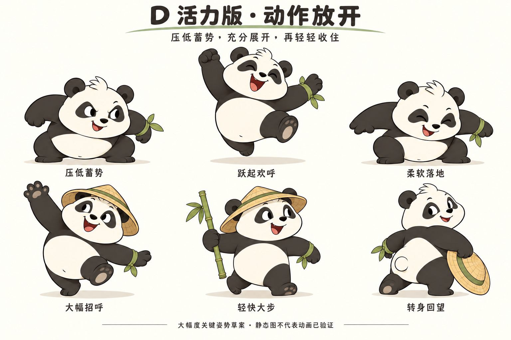

# D 熊猫活力版动作与表情

2026-10-07。用户认可当前整体形象，要求参照所附 D 设计图加大动作幅度，让身体更灵活活泼，表情更夸张。本轮保留 D2 本体、草帽与竹子，只深化动作与表演。D3 是美术稿版本，不是产品代码版本。

## 动作放开

与 D2 相比，主要放大重心高低、躯干曲线、四肢张合、身体扭转及面部反应，不靠把手脚拉成长人形来获得幅度。

| 姿势 | 本轮可见变化 | 后续动态重点 |
| --- | --- | --- |
| 压低蓄势 | 腹部与髋部明显降低，身体更宽更紧凑，爪子后收 | 短暂停顿应带着“马上要动”的意图 |
| 跃起欢呼 | 双脚离地，双爪不对称展开，露出脚掌，张口大笑 | 保留圆润体积，跳跃有起落与重量 |
| 柔软落地 | 膝髋和腹部一起吸收落地，双爪展开平衡 | 接地后收稳，头部适量跟随，不持续弹跳 |
| 大幅招呼 | 高举爪、侧倾躯干、另一爪反向平衡，表情打开 | 手爪走弧线，头、胸腹和脚一起响应 |
| 轻快大步 | 前后脚拉开，身体前移，竹子持在身体外侧 | 明确前脚接触与后脚蹬离，避免像坐着踢腿 |
| 转身回望 | 脚与臀部保留行进方向，胸肩与头回转，帽子拿在侧面 | 通过转体和眼神表达邀请，避免脖子独立拧转 |

顶排三个姿势是庆祝跳跃的选取关键态，不是完整连续帧。中间过程、速度、停顿与落地恢复还需要实际样片，不能把三个静态图机械插值就当作动画完成。

本轮图像检查后修正了落地图中多余的轮廓，以及大步姿势的脚底支撑关系。初稿另存[D3-movement-before-polish.png](D3-movement-before-polish.png)，最终参考以本页主图为准。

## 表情放开

| 表情 | 强化内容 |
| --- | --- |
| 开怀大笑 | 眼睛弯起、脸颊上提、嘴明显打开，头随笑声后倾 |
| 哇，惊喜 | 眉眼抬高、嘴成圆形，短爪与上身一起回应 |
| 认真蓄势 | 眉眼集中、下巴略低，保持机灵的笑意 |
| 调皮眨眼 | 单眼闭合、笑嘴展开、头部明显倾斜 |
| 得意一下 | 半闭眼与不对称笑嘴，头和肩有高低差 |
| 呼，放松 | 眼睑、嘴和肩颈一起松下来，形成动作后的反差 |

保留 D 的小黑鼻、短口鼻、眼斑与面颊特征。夸张来自眼睑、眉、嘴、头部和上身共同表演，不是永久放大眼睛或改变脸型。

## 幅度有层次

新的活力版用于明确的反应与表演峰值，D2 的平静表情和自然站立仍作为常态，避免每个时刻都处于最大幅度。

- 招呼、欢呼：可以大幅打开身体与笑容。
- 起跳前和落地后：用明显压低形成一伸一收。
- 行走：有足够步幅和身体转动，不需要每一步都像起跳。
- 回望：以转体、视线和单侧表情为主。
- 待机与休息：允许安静下来，让下一次大动作有反差。

草帽、竹子继续可摘取。跳跃和落地草案使用空手；持竹主要用于同行，竹子保持在身体外侧。不要把道具摆动幅度当作身体灵活度的替代。

此处的夸张用于作者设计的角色表演，不自动应用到真实摄像头镜像，镜像仍应忠实保留用户动作的时序和方向。

## 当前状态

已完成两张静态深化图：六个大幅度动作关键态与六种夸张表情。用户随后认可当前形象并要求深化抬手互动，最新见[抬手互动设计](../d4-hand-interaction/INTERACTION-DESIGN.md)。静态形象认可不等于连续动画已通过。

本轮使用内置 imagegen，生成与修订提示词保存在[图像生成记录](image-prompts.json)。未制作可播放动画，也未修改产品代码或向项目窗口发送实施指令。

下一步应基于认可的动作强度制作一段实际播放样片，检查蓄势、放开、停顿和收势是否连贯，再进入最终美术交接。

