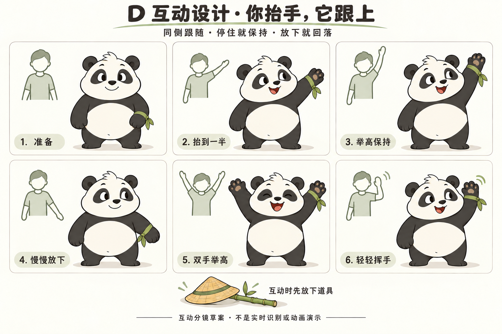

# D 熊猫抬手互动规范

推荐主体验为“手臂跟随你，眼神和表情回应你”。用户已要求深化抬手互动；这套实时跟随模式是 D4 设计建议，尚未代表用户在多个互动模式间完成最终选择。可先按此制作可验证样例，并清楚标注采用的假设。

## 进入和退出

用户主动进入“一起动”，了解相机用途并点击开启后才启动。普通角色展示和预设表演无需相机。角色在准备状态放竹、摘帽、看向用户，准备动画可跳过；模型或相机未就绪时清楚显示“准备中”。

拿到可靠输入后进入跟随。用户结束时停止相机与跟随，再恢复日常状态。页面隐藏、退出、画布失败和跟随异常的释放行为应沿用并复核现有产品处理；恢复画面不自动重开相机。

相机不可用时可以看普通表演，但预设动作必须标明为演示，不显示“正在跟随”。

## 六种互动行为

| 用户行为 | 手臂与身体 | 表情回应 |
| --- | --- | --- |
| 准备 | 空手站稳，两爪自然放松 | 看向用户，温和注意 |
| 单手抬到一半 | 对应画面侧连续抬起，任意中段可停 | 短暂看向爪，再看回用户 |
| 举高保持 | 保留当前手臂高度与弯曲，不自动补动作 | 开心峰值后转小笑，允许眨眼 |
| 放下手臂 | 跟随当前有效输入下降 | 放松，恢复平静 |
| 双手举高 | 两臂独立，保留先后与高度差 | 可短暂更开心，不自动跳起 |
| 挥动手臂 | 跟随前臂和腕位置往返，保持用户节奏 | 更明亮的笑与注意力 |

连续性是关键：开始、停住、重新移动、放下都必须对应当前输入。“一检测到抬手就播完一次举高”不满足本设计。举高保持也不自动触发挥爪、跳跃、后仰、计次或训练完成。

表情是角色表演，不表示识别了人的情绪。若输入只有肩、肘、腕，最多说明手臂位置跟随，不能宣称识别了手指、手掌开合或精确腕部旋转。

## 短爪映射

保持短爪圆身。按抬起程度、弯肘程度与方向映射到角色可读姿态，不追求熊掌与人的腕点在画面绝对重合。

至少检查自然垂下、起抬、中段、举高、下降中段、归位，并加入反向和中段暂停。肩根轮廓连续，抬臂时爪与脸留出空隙，不反折、拉成人形长臂或穿进白肚。

跟随期间身体主动作只来自可靠输入。没有可靠下肢输入时脚稳定；不要为了显得可爱给人体输入加虚构蓄势、自动侧倾或跳跃。适量形态修正可以帮助轮廓连续，但不能改变动作意图和方向。

滤波服务于减少噪声，需要同时测量延迟；不为“柔软”而排队播放旧帧，也不把作者动画中的延迟、蓄势和惯性原样套到输入控制手臂。

## 左右对应

默认镜子式体验，以用户看到的镜像预览画面为准：

| 用户动作 | 镜像预览中的位置 | 正面熊猫执行 |
| --- | --- | --- |
| 抬自己的右手 | 画面右侧 | 熊猫自身左爪，带绿色腕结 |
| 抬自己的左手 | 画面左侧 | 熊猫自身右爪，不带腕结 |
| 双手抬起 | 左右各自可见 | 两臂分别对应，保留差异 |

镜像变换只应用一次。人物解剖左右、模型输出左右和显示左右不能混用。绿色腕结始终挂在熊猫自身左腕，不随识别到哪只手而换边。进入跟随采用正面固定观察，先验证这一范围再考虑其他朝向。

## 身体控制与表演

| 模式 | 身体控制来源 | 可以额外做的事 |
| --- | --- | --- |
| 角色表演 | 动画时间轴 | 大幅招呼、扶帽、回望、走路、蓄势跳跃与落地 |
| 一起动 | 当前可靠的用户输入 | 眼神、眨眼、眉嘴回应；不抢占手臂 |
| 丢失后恢复 | 明确标示的恢复过程 | 短暂保持，必要时缓慢回到休息位 |
| 已结束 | 普通角色状态 | 放松、恢复道具与常态 |

同一时刻只有一套身体主控制来源。进入跟随清除预设残留；退出后清除过期输入。完整欢呼或扶帽由明确的表演入口触发，不因一次普通举手突然开始。若未来采用“抬手触发一次趣味回应”，需作为独立模式说明，不把它标成逐帧模仿。

## 看不清时

| 情况 | 处理要求 |
| --- | --- |
| 单侧手臂被挡 | 只暂停受影响的链；另一侧仅在可靠时继续 |
| 肩或整个人离开画面 | 暂停相关驱动，不能继续声称正在同步 |
| 持续丢失 | 明确进入恢复状态，温和归位，不无限保持高举 |
| 重新出现 | 清除旧姿态队列，接到当前可靠姿态，避免突然甩臂 |
| 用户关闭或发生错误 | 停止相机，明确显示结束或不可用，不自动重开 |

“这只手暂时看不清”“回到画面里，我再跟你一起动”是可选中文文案。不用生气、惩罚或失败表情回应识别问题。

可信度阈值、丢失持续时限与延迟指标均需实现后测量，再写入交付记录。本包没有承诺某个毫秒数或所有设备流畅。

## 最先验证的片段

先制作约 8 至 12 秒的**预设设计样片**：空手准备 → 单手慢抬 → 中段停住 → 继续举高 → 保持 → 放下 → 平静。它证明角色的连续姿势与表情可成立，不证明相机跟随有效。

然后用真实输入检查左手、右手、双手不同步、挥动、中途反向、遮挡和恢复。真实相机测试由用户主动开启；无法完成时明确列为未测，不用模拟姿态冒充。

验收时同时展示输入与角色。用户停住后爪子不继续上升，放下后不多挥一次，双臂不被强制同步；静止手臂稳定但脸仍有注意力。

