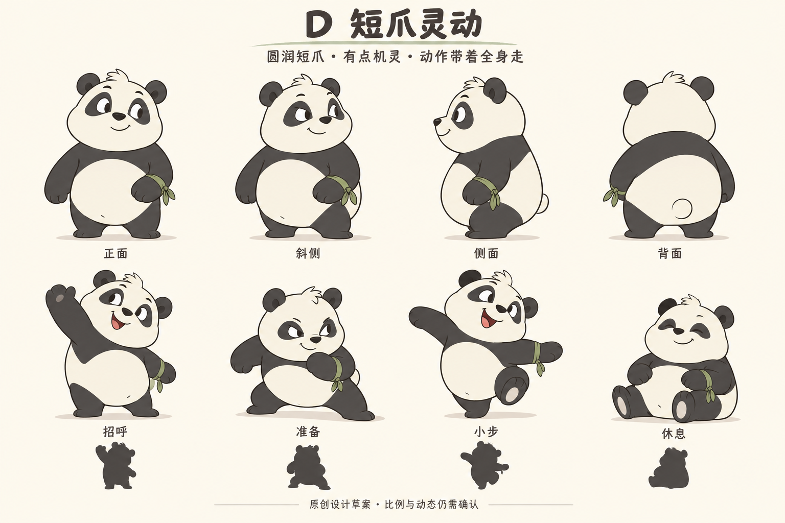
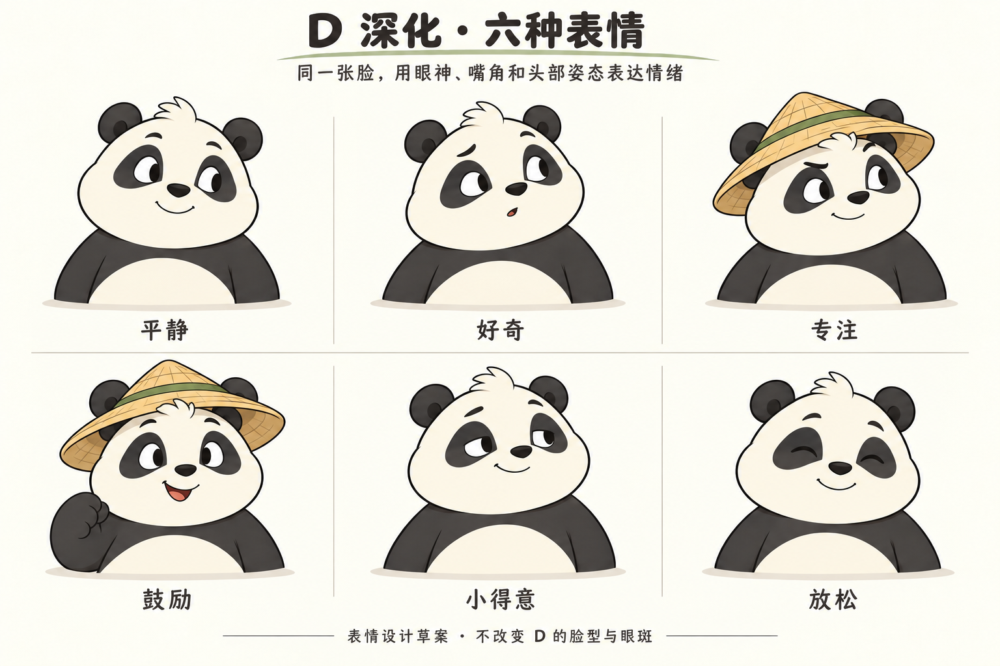
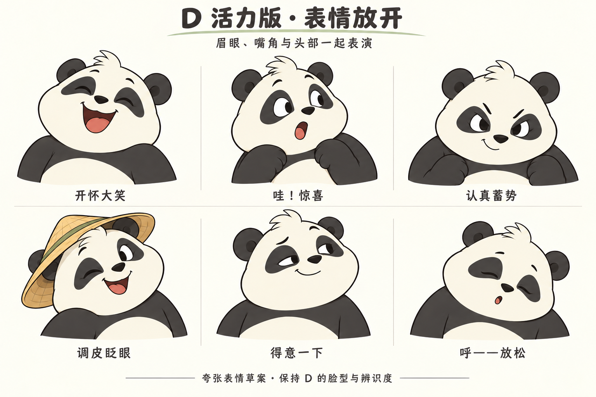

# D 熊猫形象与道具规范

目标是复现用户认可的短爪熊猫，而后让它自然地动起来。角色给人的感觉应当是圆润、机灵、亲近，有一点俏皮，既能活跃回应，也能安静陪伴。

## 本体不能丢失的特征

| 部位 | 应保持的设计 | 制作时检查 |
| --- | --- | --- |
| 头与面颊 | 奶白、略方而圆润的脸，饱满面颊，短口鼻 | 侧转仍有面颊与口鼻层次，不能变成一个正圆贴五官 |
| 额头与耳朵 | 小毛簇、两只炭黑圆耳 | 毛簇方向和耳根固定；帽子与耳朵有正确前后关系 |
| 眼睛与眼斑 | 叶形或豆形深色眼斑，眼白、瞳孔、眼睑可表达视线 | 不永久放大为玻璃球大眼；左右透视变化仍像同一张脸 |
| 鼻与嘴 | 小黑鼻、短吻、可闭口也可张口笑 | 不换成旧参考的红鼻头，不随嘴张开改变身份 |
| 胸腹与背 | 紧凑梨形或豆形圆身，奶白腹部，炭黑肩背 | 白肚贴合身体，随压缩和扭转变化，不能像悬浮护甲 |
| 前爪 | 短厚、柔软、简化熊掌 | 肩根、肘部连续，张开、松弛、握持有不同轮廓 |
| 后爪 | 短、能承重，有可读脚掌朝向 | 不能拉成人形长腿，落地不能只靠脚尖插在地面 |
| 尾巴 | 小而简洁，位于背面正确位置 | 随躯干运动，不增加额外尾巴或白色残影 |
| 绿色腕结 | 仅在熊猫自身左腕 | 正面时位于观众右侧；转身后随左腕走，不固定屏幕位置 |

去掉所有道具仍须认出 D。不能依赖帽子来掩盖脸型、比例或眼斑偏差。

## 比例与转面

约两头身是已有草图的起点，最终轮廓以 D2 空手主图为主要依据。不要重新采用旧方案中的 2.5 至 3 头身、可见人形肩膀、机械肘或长腿要求。

D1 包含正面、斜侧、侧面和背面意向，但并非精确正交图。制作前应在同一身高基线下统一正面、左右斜侧、侧面与背面，固定头宽、腹部宽、耳根、肩根、腕结及帽子安装位置。左右不能只翻转成带两个腕结的近似图。

先用轮廓与大色块核对站姿，再检查抬爪中段、举高、下蹲、坐姿和回望。动作可以压缩和伸展，但必须保持体积感；不是所有姿势共用一个永不变形的椭圆肚子。

## 表面与画风

以清晰二维卡通主稿为外观标准：暖深色轮廓、奶白和炭黑主色、少量克制阴影。保持柔软连续的形体，不添加写实毛发、强反光塑料、复杂衣服或密集纹理。

现有项目入口使用 Canvas 2D；这只是当前技术状态。可继续以可编辑曲线和形变制作，或在必要时采用其他资产方式，但不得为了迁就工具改变角色。若以后确需三维，应以同一视角对照这些主稿，保持哑光卡通与平面轮廓，单独说明三维视角的验证范围。

以下为沿用的工作色建议，未经取样锁色，允许为实际显示做小幅统一：

| 区域 | 工作色 |
| --- | --- |
| 脸与腹部 | 暖奶白 #F3EBD7 |
| 耳、眼斑、四肢 | 炭黑 #343334 |
| 草帽 | 麦秆黄 #D9B46A |
| 竹子、帽带、腕结 | 柔和竹绿 #81945A |
| 设计展示背景 | 暖纸白 #FBF8EF |

产品背景不必做成纸张；这些 PNG 带纸色背景与标题，是设计板，不能整张贴进产品里作为活动角色。

## 道具设计

草帽使用浅帽冠、麦秆色、绿色帽带。帽檐稍宽于头，前檐抬起，不遮挡眉眼。用少量编织线表达材质；佩戴、扶帽、摘帽和放地面均是同一顶帽。

竹子是细绿竹，带少量竹节和一簇小叶。建议从含帽身高约七成的长度起步，制作时根据主图统一。由熊猫自身右爪握持，位置在身体外侧；爪上、爪下竹身连续，靠地时底端与地面一致。竹子用于同行和陪伴，不扩展为武器或识别到的健身器械。

左右定义始终以熊猫自身为准。正面时：观众左侧是持竹的右爪，观众右侧是带绿色腕结的左爪。

| 场景 | 帽子 | 竹子 | 腕结 |
| --- | --- | --- | --- |
| 日常展示 | 可戴或摘 | 可持或放旁边 | 自身左腕 |
| 扶帽招呼 | 戴着，右爪触帽檐 | 放旁边，释放右爪 | 自身左腕 |
| 大幅招呼 | 可戴或摘，双爪空闲 | 放旁边 | 自身左腕 |
| 持竹同行 | 戴着 | 自身右爪持握 | 自身左腕 |
| 摘帽致意或回望 | 右爪持帽，按动作需要 | 先放旁边 | 自身左腕 |
| 跳跃、落地、明显伸展 | 放旁边 | 放旁边 | 自身左腕 |
| 实时抬手跟随 | 放旁边 | 放旁边 | 自身左腕 |

抓取、放下、摘戴须有明确接触点和状态衔接。不能为了切换动作让道具凭空消失、突然换手、穿过头部或漂在掌外。若需要快速进入互动，可跳过准备表演并切到明确的空手准备状态，不把跳过期间标成正在同步。

## 表情身份

D2 六种常态表情与 D3 六种峰值表情共用同一头部基准。眉、眼睑、视线、嘴与头倾协作；不能只换嘴，不能每种表情换一张脸。完整分工见 [动态规范](MOTION-SPEC.md)。

## 清晰版与像素版

用户喜欢像素风，清晰版用于校对母稿。两种显示必须共用同一个角色和动作状态。像素显示不能变成另一个熊猫，也不能遮掩眼神、手爪与身体粘连的问题。

早期可用 64、96、128 像素角色高度对照，这只是探索尺寸。比较同一姿势、同一时刻与实际界面尺寸，关注眼斑、嘴型、举手留白、脚底和腕结。静态可读后再看运动中的边缘闪烁与颜色跳动；不以加模糊消除设计问题。

## 制作一致性优先级

用户明确偏好与本包规范优先；D2 定本体与道具，D3 定表演强度，D4 定互动行为。图上的偶发毛簇、腕结、掌垫或遮挡差异应在统一稿中修正，而非全部复制。保持角色识别的同时，按动作需要重绘和变形。

本轮交付包含完整视觉方向，但不含精确分层、拓扑、绑定或正交尺寸。制作方应补齐可编辑资产与统一转面，不能把概念图本身当作已经完成的绑定资产。

